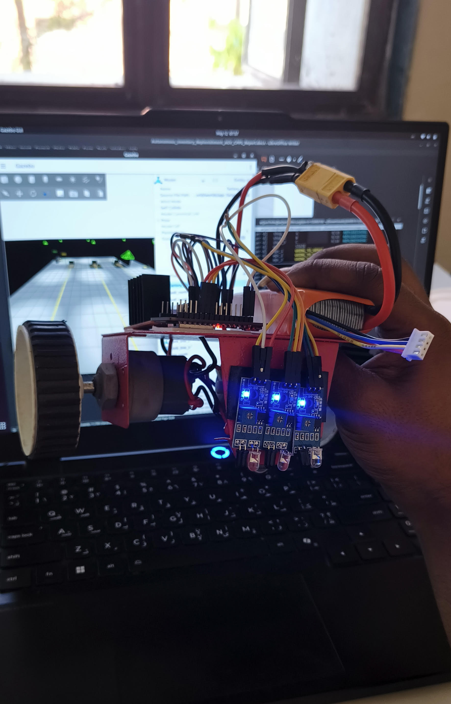
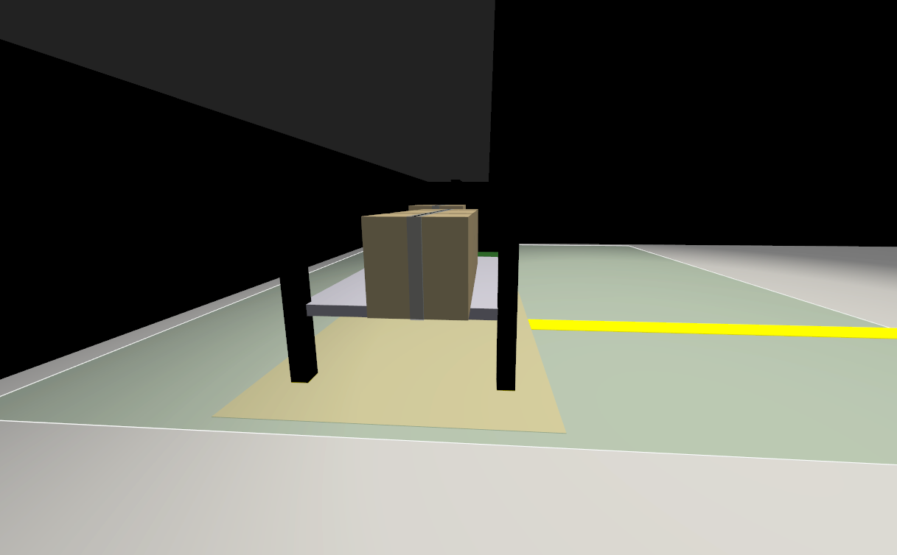
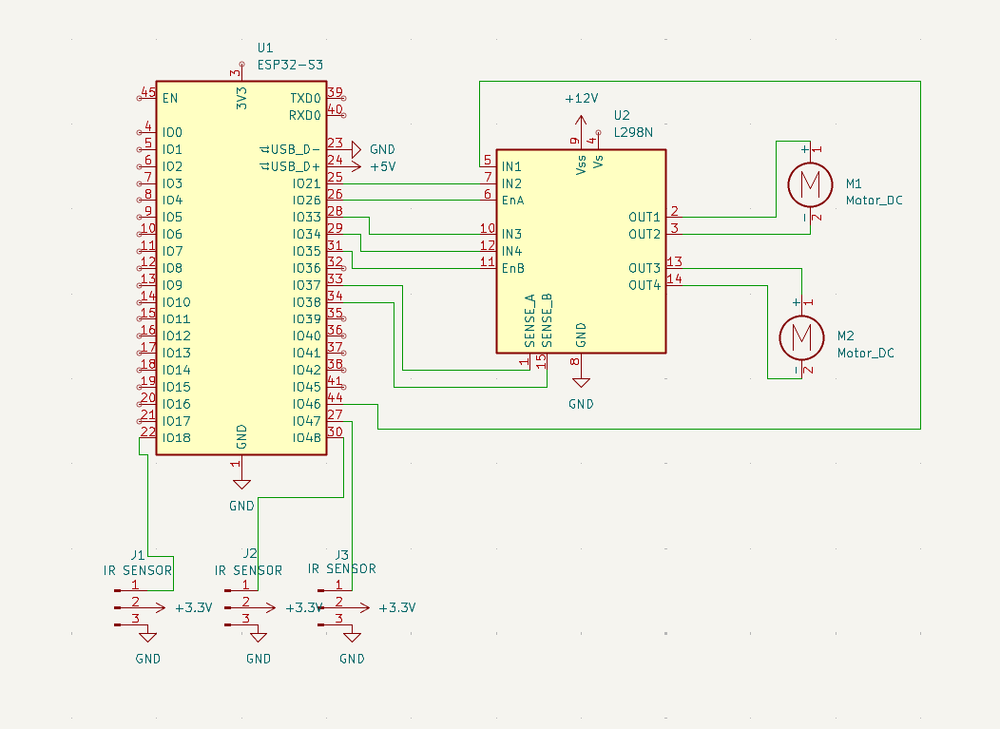

# Autonomous Inventory Replenishment AGV CPPS

An autonomous material replenishment system for a smart factory, built around the Cyber Physical Production System (CPPS) idea. The project connects a digital inventory layer with a simulated AGV fleet so that low stock at shop stations can automatically trigger robot-based material delivery.

The system is implemented with ROS 2 Humble, Ignition Gazebo 6 Fortress, Python nodes, custom ROS messages, and SDF robot/world models.


## Project Goal

The goal is to demonstrate how a factory can close the loop between production demand and physical material flow:

1. Shop stations consume material.
2. A digital inventory model tracks stock levels.
3. Low stock creates a replenishment order.
4. A fleet manager assigns an available AGV.
5. The AGV travels to the correct depot, loads material, delivers it to the shop, and returns to dock.
6. Delivery feedback updates the digital stock model.

This makes the project more than a robot simulation. It is a compact CPPS example where cyber decisions and physical movement work together.

## Visual Preview

| Simulated AGV | Physical Prototype |
|---|---|
|  |  |

| Factory Track | Inventory View |
|---|---|
|  |  |

## What It Simulates

The factory world is a 30 m by 20 m shop floor with:

| Area | Role |
|---|---|
| Depot A | Source for Material A |
| Depot B | Source for Material B |
| Depot C | Source for Material C |
| Shop 1 | Consumer station for Material A |
| Shop 2 | Consumer station for Material B |
| Shop 3 | Consumer station for Material C |
| Dock 1, Dock 2, Dock 3 | AGV home and charging positions |
| Guide line network | Fixed route system for AGV navigation |

Each shop has stock, capacity, threshold, and material type. When stock reaches the reorder threshold, the cyber layer creates a replenishment mission.

## CPPS Architecture

```text
Digital inventory twin
        |
        | /shop/inventory
        v
Order manager
        |
        | /orders/new
        v
Fleet manager
        |
        | /agv_N/task
        v
AGV controller
        |
        | /model/agv_N/cmd_vel
        v
Ignition Gazebo physical twin
        |
        | pose, status, delivery feedback
        v
Inventory update and live dashboard
```

## ROS 2 Node Responsibilities

| Node | Package | Responsibility |
|---|---|---|
| `order_manager` | `agv_cpps` | Maintains shop inventory, simulates stock consumption, and creates replenishment orders. |
| `fleet_manager` | `agv_cpps` | Assigns orders to idle AGVs using preferred material mapping and fallback selection. |
| `agv_controller` | `agv_cpps` | Runs one controller per robot, handles task state, route planning, line following, loading, unloading, and status updates. |
| `event_logger` | `agv_cpps` | Prints a live terminal dashboard for inventory, orders, AGV states, and completed deliveries. |
| `parameter_bridge` | `ros_gz_bridge` | Connects ROS 2 topics to Ignition Gazebo transport topics. |

## Main Topics

| Topic | Message | Purpose |
|---|---|---|
| `/shop/inventory` | `agv_interfaces/ShopInventory` | Publishes current stock state for each shop. |
| `/orders/new` | `agv_interfaces/ReplenishmentOrder` | Publishes new replenishment requests. |
| `/orders/assigned` | `agv_interfaces/ReplenishmentOrder` | Publishes assignment confirmation. |
| `/orders/in_progress` | `agv_interfaces/ReplenishmentOrder` | Marks active delivery work. |
| `/orders/completed` | `agv_interfaces/ReplenishmentOrder` | Confirms delivery and triggers stock update. |
| `/agv_N/task` | `agv_interfaces/ReplenishmentOrder` | Sends an assigned task to a specific AGV. |
| `/agv_N/status` | `agv_interfaces/AGVStatus` | Publishes robot state, order id, material, battery, and position. |
| `/agv_N/ir_sensor` | `std_msgs/String` | Publishes virtual line sensor status. |
| `/model/agv_N/cmd_vel` | `geometry_msgs/Twist` | Sends velocity commands to the simulated AGV. |

## Navigation Model

The AGVs move on a fixed guide line network. Docks, junctions, depots, and shops are represented as graph nodes. The controller uses Breadth First Search to find a route from the current node to the target node.

Line following is handled with a virtual five-channel IR sensor model. The sensor estimates lateral error from the guide line, and the controller combines that error with heading error to generate velocity commands.

AGV state flow:

```text
IDLE -> GOING_TO_DEPOT -> LOADING -> GOING_TO_SHOP -> UNLOADING -> RETURNING -> IDLE
```

## Factory Line Network

```text
DEPOT_A(-12,8)              DEPOT_B(+12,8)
      |                           |
   J_WN -------------------- J_EN       y=+5
      |    J_NW--J_NC--J_NE--J_SHOP_N--SHOP_1
      |                           |
   J_WM ------------ J_SHOP_M--SHOP_2   y=0
      |                           |
  DEPOT_C(-12,-3)      J_SHOP_S--SHOP_3
      |                           |
   J_WS ------------------ J_ES         y=-5
      |                           |
   J_SW      J_SC      J_SE
      |         |         |
  DOCK_1    DOCK_2    DOCK_3           y=-8.8
```

## Hardware and Wiring

The physical prototype follows the same core concept as the simulation: a wheeled AGV chassis, controller, motor driver, motors, battery, and line sensing.




## Technology Stack

| Layer | Technology |
|---|---|
| Robot middleware | ROS 2 Humble |
| Simulation | Ignition Gazebo 6 Fortress |
| ROS and Gazebo bridge | `ros_gz_bridge` |
| Node implementation | Python 3 |
| Robot and world format | SDF |
| Build system | `colcon` |
| Custom messages | `agv_interfaces` |

## Repository Structure

```text
agv_factory/
├── ros2/
│   ├── agv_cpps/
│   │   ├── agv_cpps/
│   │   │   ├── agv_controller.py
│   │   │   ├── event_logger.py
│   │   │   ├── fleet_manager.py
│   │   │   └── order_manager.py
│   │   └── launch/cpps_sim.launch.py
│   ├── agv_factory_world/
│   │   ├── worlds/agv_factory.world
│   │   └── models/
│   └── agv_interfaces/
│       └── msg/
├── snaps/
│   └── project screenshots and wiring images
└── README.md
```

## Requirements

- Ubuntu with ROS 2 Humble
- Ignition Gazebo 6 Fortress
- `ros-humble-ros-gz-sim`
- `ros-humble-ros-gz-bridge`
- Python 3
- `colcon`

Install bridge packages if needed:

```bash
sudo apt update
sudo apt install ros-humble-ros-gz-sim ros-humble-ros-gz-bridge
```

## Build and Run

From the repository root:

```bash
colcon build
source install/setup.bash
ros2 launch agv_cpps cpps_sim.launch.py
```

Optional: change the inventory consumption interval.

```bash
ros2 launch agv_cpps cpps_sim.launch.py consume_interval_sec:=5.0
```

## Expected Runtime Behavior

After launch:

- Gazebo opens the factory world.
- Three AGVs appear at their dock positions.
- Shop inventory is published at regular intervals.
- Stock decreases over time.
- Low stock creates replenishment orders.
- The fleet manager assigns AGVs to orders.
- AGV controllers publish task state and movement commands.
- The event logger prints a live CPPS summary in the terminal.

## Design Highlights

- Digital inventory twin for shop stock monitoring.
- Event-driven replenishment order generation.
- Multi-AGV fleet assignment with idle fallback.
- Graph based route planning over a factory guide line network.
- Virtual IR line sensing and proportional line correction.
- Gazebo physical twin for factory layout, robot models, depots, docks, shops, and guide tracks.
- Live observability through ROS 2 topics and terminal logging.

## Current Scope and Extension Ideas

The current system focuses on a structured factory with fixed guide lines and rule based fleet assignment. Useful next steps include:

- Dynamic obstacle detection and local avoidance.
- Junction traffic control for larger AGV fleets.
- Battery discharge and charging behavior.
- Real hardware deployment with calibrated IR sensors and motor drivers.
- Web dashboard for inventory, order, and fleet monitoring.
- More advanced scheduling based on distance, priority, and shop demand.

## Documentation

Generated reports and local project notes can be kept outside the core ROS 2 build flow, while the simulation itself remains fully runnable from the source packages.
